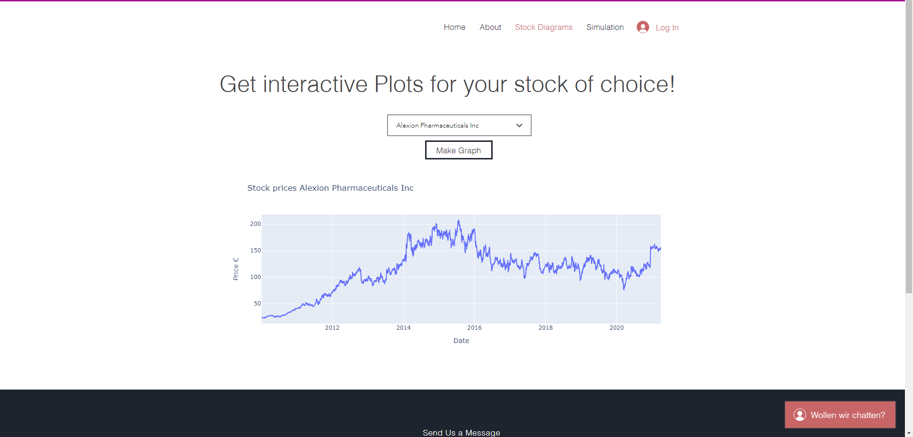

# Stocks Plot and Simulation Website

A demo Website for plotting and simulate the revenue of holding different stocks over a period. Implemented automatic web scraping to get stocks data (which is currently not available due to the free version of the hosting site). The scrapped data is then saved in a MySQL Database which can be accessed via an REST-API (Flask).

Demo-Website:

